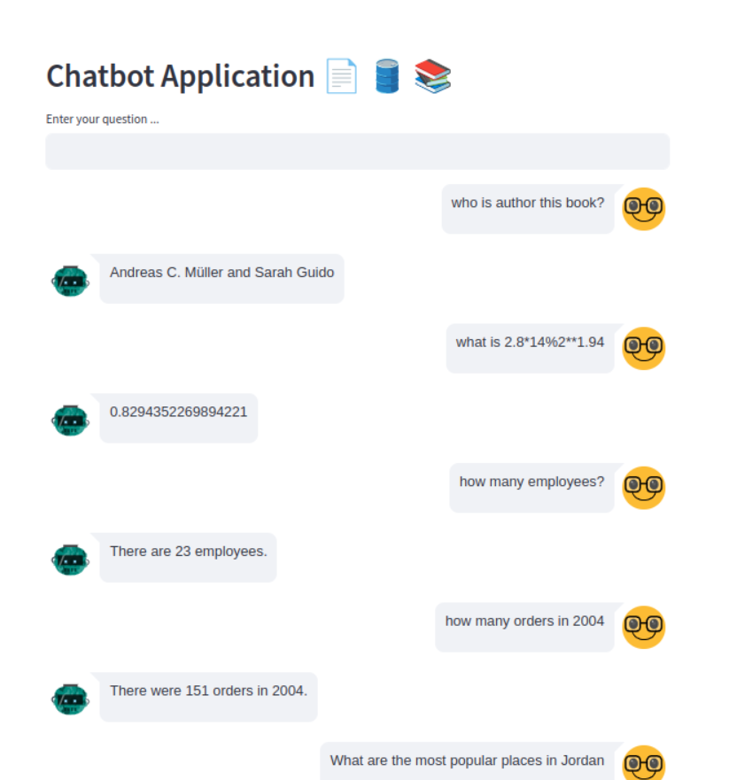
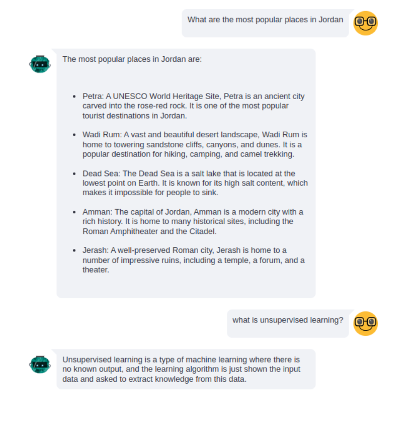

# chatbot-App 💬 📚
chatbot application get answer from database, math, pdf, General knowledge


## Requirements
python 3.8 or later

Enviroment
    
anaconda /visual studio code 

cd in path-folder

### Install 
```bash
$ pip install -r requirements.txt
```
```bash
$ steamlit run src/app.py 
```
## Deployment & use case

 ### 1- **Chatbot** 🤖

 
 
#### Using streamlit chat for deployment
- ask question
- conversational agent determines the direction of question using tool [pdf, database , math, general knowledge]
- tools using function for get chains 
- using sql database for build chain
- using pypdf for read pdf file ,  split this file into chunks & embedding all chuncks using sentence-transforme
save this embedding in chroma database when ask question then compare embedding with embedding in database using similarity 
- after that LLM-GEMINI Formulates the answer 


